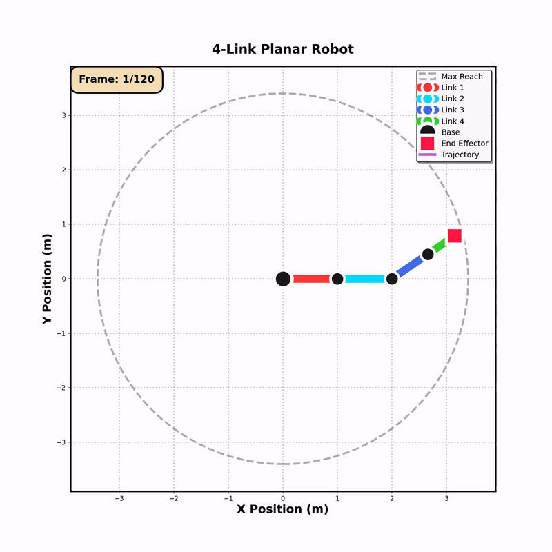
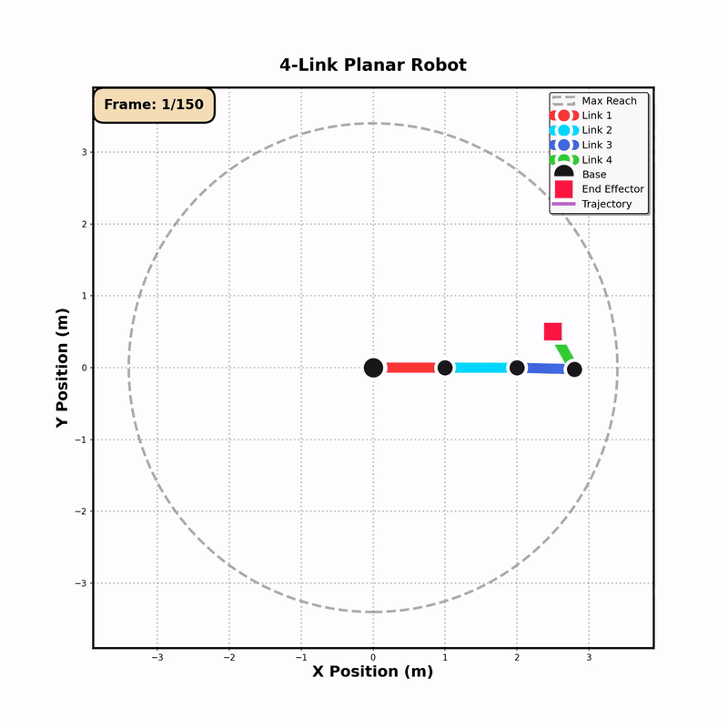
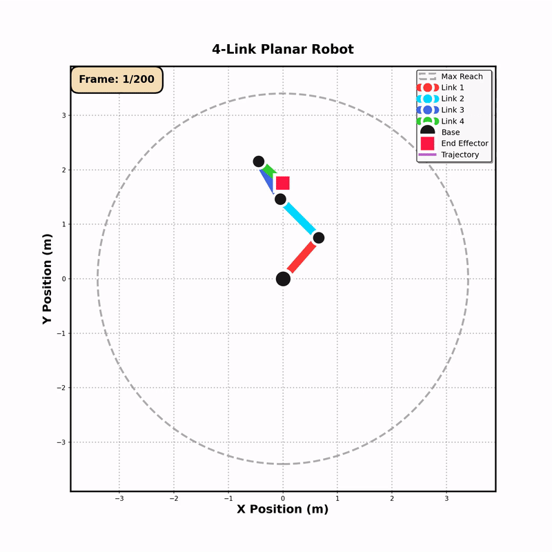
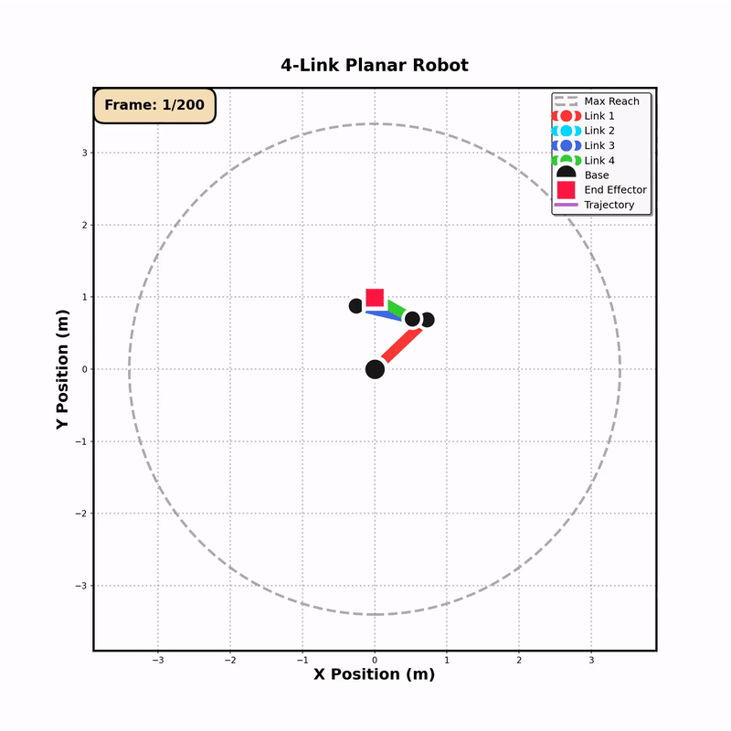
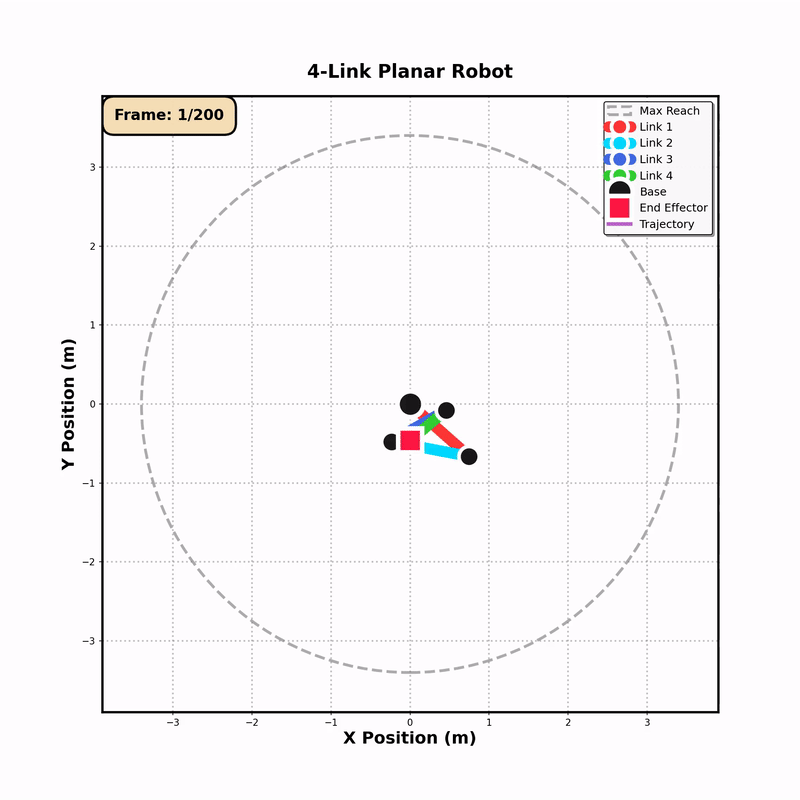

# 4-Link Planar Robot Kinematics Simulation

**Author: BESLI SAUT MARITO PAKPAHAN**  
*SEMS6 - Legged Robot Course*

---

A comprehensive simulation suite for a 4-link planar robot arm, featuring forward kinematics, inverse kinematics, trajectory following, and workspace analysis.

## 🎥 Demos & Animations

### Forward Kinematics - All Joints Moving


### Inverse Kinematics - Circle Trajectory


### Trajectory Following - Heart Shape


### Trajectory Following - Spiral Pattern


### Trajectory Following - Star Pattern


## 📋 Features

- **Forward Kinematics**: Calculate end-effector position from joint angles
- **Inverse Kinematics**: Two methods available:
  - Analytical solution for 2-link equivalent
  - Cyclic Coordinate Descent (CCD) for full 4-DOF control
- **Advanced Trajectory Following**: Follow complex paths (circles, spirals, hearts, stars, etc.)
- **Workspace Analysis**: Visualize and analyze the robot's reachable workspace
- **Rich Visualizations**: High-quality animations and plots
- **Video Export**: Save simulations as MP4 videos
- **Interactive Jupyter Notebook**: Experiment with the robot interactively

## 🤖 Robot Configuration

The robot consists of 4 links with the following default lengths:
- Link 1: 1.0 m
- Link 2: 1.0 m
- Link 3: 0.8 m
- Link 4: 0.6 m

**Total Maximum Reach**: 3.4 m

## 📁 Project Structure

```
PLANAR_KINEMATIC/
├── kinematics.py                        # Core kinematics module (FK & IK)
├── visualizer.py                        # Visualization and animation utilities
├── simulation_1_forward_kinematics.py   # Forward kinematics demo
├── simulation_2_inverse_kinematics.py   # Inverse kinematics demo
├── simulation_3_trajectory.py           # Trajectory following demo
├── simulation_4_workspace.py            # Workspace analysis
├── run_all_simulations.py               # Run all simulations
├── interactive_demo.ipynb               # Jupyter notebook for interactive use
├── requirements.txt                     # Python dependencies
├── README.md                            # This file
└── outputs/                             # Generated videos and images
    ├── fk_*.png/mp4                     # Forward kinematics outputs
    ├── ik_*.png/mp4                     # Inverse kinematics outputs
    ├── trajectory_*.mp4                 # Trajectory following outputs
    └── workspace_*.png/mp4              # Workspace analysis outputs
```

## 🚀 Getting Started

### Prerequisites

- Python 3.8 or higher
- FFmpeg (for video generation)

#### Install FFmpeg

**Ubuntu/Debian:**
```bash
sudo apt-get update
sudo apt-get install ffmpeg
```

**macOS:**
```bash
brew install ffmpeg
```

**Windows:**
Download from [ffmpeg.org](https://ffmpeg.org/download.html)

### Installation

1. Clone or navigate to this repository:
```bash
cd /path/to/PLANAR_KINEMATIC
```

2. Install Python dependencies:
```bash
pip install -r requirements.txt
```

## 🎬 Running Simulations

### Option 1: Run All Simulations

Run all four simulations sequentially:
```bash
python run_all_simulations.py
```

This will generate all videos and images in the `outputs/` folder.

### Option 2: Run Individual Simulations

Run simulations individually:

```bash
# Simulation 1: Forward Kinematics
python simulation_1_forward_kinematics.py

# Simulation 2: Inverse Kinematics
python simulation_2_inverse_kinematics.py

# Simulation 3: Trajectory Following
python simulation_3_trajectory.py

# Simulation 4: Workspace Analysis
python simulation_4_workspace.py
```

### Option 3: Interactive Jupyter Notebook

For interactive experimentation:
```bash
jupyter notebook interactive_demo.ipynb
```

## 📊 Simulation Details

### Simulation 1: Forward Kinematics

Demonstrates how joint angles affect the end-effector position.

**Outputs:**
- 6 static configuration snapshots
- 1 comparison plot
- 4 animation videos:
  - Single joint rotation
  - All joints rotating simultaneously
  - Wave motion pattern
  - Joint space trajectory

**Key Concepts:**
- Direct computation from joint angles to end-effector position
- Joint space exploration
- Configuration comparison

### Simulation 2: Inverse Kinematics

Shows how to reach target positions using two IK methods.

**Outputs:**
- Multiple target reaching snapshots (analytical method)
- CCD-based solutions
- 4 animation videos:
  - Circular path following
  - Figure-8 path
  - Square path
  - Multi-target reaching

**Key Concepts:**
- Analytical IK (2-link equivalent)
- Cyclic Coordinate Descent (CCD)
- Redundancy resolution
- Path following

### Simulation 3: Trajectory Following

Demonstrates following complex trajectories.

**Outputs:**
- 5 trajectory animations:
  - Spiral path
  - Heart shape
  - Star pattern
  - Infinity symbol (lemniscate)
  - Sine wave
- Comparison plot

**Key Concepts:**
- Smooth trajectory generation
- Continuous IK solving
- Path planning

### Simulation 4: Workspace Analysis

Analyzes the robot's reachable workspace.

**Outputs:**
- Random sampling visualization
- Systematic sampling visualization
- Density heatmap
- Boundary detection (convex hull)
- Workspace exploration animation
- Statistics text file

**Key Concepts:**
- Workspace characterization
- Reachability analysis
- Density distribution
- Configuration space sampling

## 🔧 Customization

### Modify Robot Configuration

Edit link lengths in any simulation file:

```python
link_lengths = [1.0, 1.0, 0.8, 0.6]  # [L1, L2, L3, L4]
robot = PlanarRobot4Link(link_lengths)
```

### Create Custom Trajectories

Add custom path functions in `simulation_3_trajectory.py`:

```python
def generate_custom_path(n_points=200):
    path = []
    for i in range(n_points):
        t = (2 * np.pi * i) / n_points
        x = # your x equation
        y = # your y equation
        path.append([x, y])
    return np.array(path)
```

### Adjust Animation Parameters

Modify visualization parameters:

```python
viz.animate_trajectory(
    angles_sequence,
    filename='my_animation.mp4',
    fps=30,                    # Frames per second
    show_trajectory=True,      # Show trajectory trail
    show_workspace=True        # Show workspace boundaries
)
```

## 📐 Mathematics

### Forward Kinematics

Given joint angles θ₁, θ₂, θ₃, θ₄, the end-effector position is:

```
x = L₁cos(θ₁) + L₂cos(θ₁+θ₂) + L₃cos(θ₁+θ₂+θ₃) + L₄cos(θ₁+θ₂+θ₃+θ₄)
y = L₁sin(θ₁) + L₂sin(θ₁+θ₂) + L₃sin(θ₁+θ₂+θ₃) + L₄sin(θ₁+θ₂+θ₃+θ₄)
```

### Inverse Kinematics

Two methods:

1. **Analytical**: Fixes θ₃ and θ₄, solves 2-link IK for θ₁ and θ₂
2. **CCD (Cyclic Coordinate Descent)**: Iteratively adjusts each joint to minimize error

## 📈 Performance

Typical execution times (Intel i7, 16GB RAM):
- Simulation 1: ~30 seconds
- Simulation 2: ~45 seconds
- Simulation 3: ~60 seconds
- Simulation 4: ~90 seconds

**Total: ~3-4 minutes for all simulations**

## 🎨 Color Scheme

The visualizations use a carefully chosen color palette:
- **Link 1**: Red (#FF6B6B)
- **Link 2**: Turquoise (#4ECDC4)
- **Link 3**: Sky Blue (#45B7D1)
- **Link 4**: Green (#96CEB4)
- **Joints**: Dark Gray (#2C3E50)
- **End Effector**: Bright Red (#E74C3C)
- **Target**: Orange (#F39C12)
- **Trajectory**: Purple (#9B59B6)

## 🐛 Troubleshooting

### FFmpeg Not Found

If you get "FFmpeg not found" errors:
1. Install FFmpeg (see Prerequisites)
2. Ensure FFmpeg is in your system PATH
3. Restart your terminal/IDE

### Animation Issues

If animations don't save properly:
- Try saving as GIF instead: Change `.mp4` to `.gif` in filenames
- Check disk space
- Ensure `outputs/` directory exists

### Memory Issues

If you run out of memory:
- Reduce `n_frames` in simulation scripts
- Reduce `n_samples` in workspace analysis
- Run simulations individually instead of all at once

## 📚 References

- Craig, J. J. (2005). *Introduction to Robotics: Mechanics and Control*
- Spong, M. W., Hutchinson, S., & Vidyasagar, M. (2006). *Robot Modeling and Control*
- Siciliano, B., et al. (2010). *Robotics: Modelling, Planning and Control*

## 👨‍💻 Author

**BESLI SAUT MARITO PAKPAHAN**

Created for the Legged Robot course (SEMS6)  
Date: March 2026

## 📄 License

This project is open source and available for educational purposes.

## 🌟 Acknowledgments

- Planar kinematics concepts from robotics textbooks
- Visualization inspired by modern robotics libraries
- CCD algorithm implementation based on research papers

---

**Enjoy exploring robot kinematics! 🤖**

For questions or issues, please check the documentation or create an issue in the repository.
